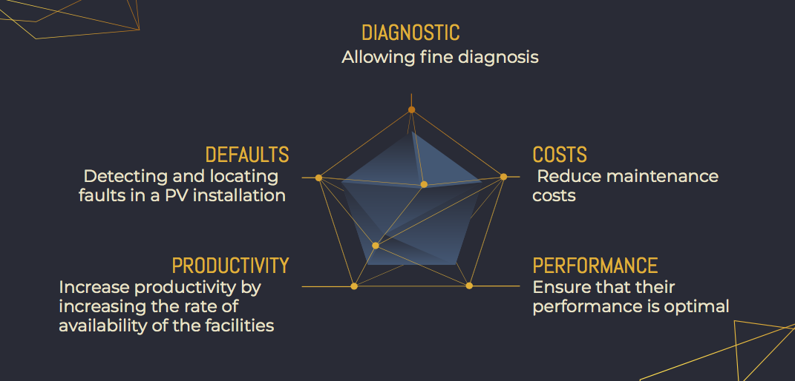

.. Voltasafe documentation master file, created by
   sphinx-quickstart on Fri Apr  2 20:57:15 2021.
   You can adapt this file completely to your liking, but it should at least
   contain the root `toctree` directive.

VOLTASAFE
==========

.. toctree::
   :maxdepth: 3
   :caption: Contents:

Description:
==================
Pendant son fonctionnement, une installation PV peut être soumise à divers défauts et à des conditions de fonctionnement anormales.
Les défauts et anomalies qui peuvent varier dans une installation dépendent de plusieurs facteurs, notamment la technologie et 
la robustesse des modules PV, la conception et la construction de l'installation, les conditions climatiques et l'environnement. Les principaux défauts et anomalies les plus souvent rencontrés sont la détérioration des cellules, la fissuration, l'échauffement des cellules - la pénétration de l'humidité, la dégradation des interconnexions, la corrosion des connexions des cellules, etc. - et l'endommagement des cellules.

Solution
========

 
 > Détection et localisation des défauts dans une installation PV

 > Fournir aux utilisateurs d'énergie photovoltaïque un service de surveillance et de diagnostic  
 des dysfonctionnements de l'installation en temps réel.
 
 > Facilité d'entretien et de maintenance
 
La solution permet de surveiller à distance une installation photovoltaïque grâce à des capteurs connectés à une passerelle. Cette passerelle centralise toutes les données afin de les enregistrer et/ou de les envoyer à un serveur. Sur la base de ces données, la passerelle effectue des calculs et des comparaisons, envoie des alertes et des messages d'alerte. 

 
Nos capteurs
============
   * Capteur de temperature
   * capteur humidité
   * capteur courant
   * capteur ensoleillement
   
.. list-table:: Capteur
   :header-rows: 1

   * - List
     - Capteur
     - Description
   * - Temperature _
     - xx
     - xx
   * - Humidite _
     - xxx
     - xxxx.
   * - Courant _
     - xxx
     - xxx
   * - Ensoleillement _
     -  xxx
     - xxxx

Architecture et protocoles reseaux
===================================

Application
===========

* :ref:`genindex`
* :ref:`modindex`
* :ref:`search`
